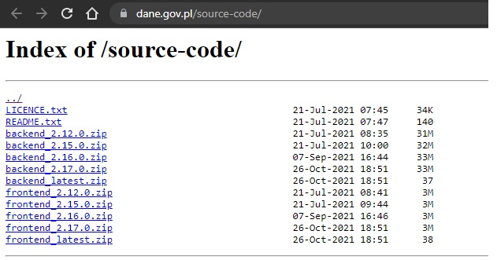

# dane.gov.pl-open-data
https://dane.gov.pl/ -  mirror of source code from https://gitlab.dane.gov.pl/otwarte-dane

Currently GitLab redirect to page with zip files:


backend_2.17.0.zip has the same files as backend_latest.zip

frontend_2.17.0.zip has the same file as frontend_latest.zip

This repository includes data from GitLab and from zip files - look at branches.

## This is source code of [dane.gov.pl](https://dane.gov.pl/) (page that provides open data in Poland)
Read for more information: https://dane.gov.pl/about
>
> This is a one-stop shop for data from over 100 public institutions. The website is a source of reliable, constantly updated data, made available free of charge for re-use. An up-to-date list of data providers is available in the Suppliers section.
>
> We have created this website for:
>
> * citizens interested in the activities of the state;
> * companies that build innovative products and services based on data;
> * NGOs using data in their daily work;
> * scientists carrying out research;
> * officials preparing reports and analyses.
>
> No registration is required to use the website.
>
> If you would like to access additional functionalities, including creating your own data sets and conveniently tracking data updates, you should create an account on our website.
> 
> ## Contact
> All questions concerning the functioning of the website, as well as comments regarding quality of data should be sent to: kontakt@dane.gov.pl.
>
> If you have created an application that uses public data available on the website, feel free to share it with us. We will publicise it on our website. Contact us if you haven't found the data you need. Describe in detail the type of data you are looking for. We will analyse the possibility of making them available by suppliers.
> 
> ## Legal basis
> 
> The Dane.gov.pl website pursues the objective of the Central Public Data Repository, as described in the Act on Access to Public Information (Dz. U. [Journal of Laws] no. 112, item. 1198 as amended) as one of the modes of accessing and reusing public information.
> 
> The following regulations were issued on the basis of the Act:
> * [Regulation of the Council of Ministers regarding the Central Public Information Repository](http://www.dziennikustaw.gov.pl/DU/2014/361/1)
> * [Regulation of the Minister of Administration and Digitisation regarding the information resource to be made available in the Central Public Information Repository](http://www.dziennikustaw.gov.pl/DU/2014/491/1)
> * [Regulation of the Minister of Administration and Digitisation of the 5th of May 2015 amending the regulation regarding the information resource to be made available in the Central Public Information Repository](http://dziennikustaw.gov.pl/DU/2015/803/1)
> 

PL version:

> O serwisie
W jednym miejscu znajdziesz dane ponad 100 instytucji publicznych. Portal jest źródłem wiarygodnych na bieżąco aktualizowanych danych, udostępnianych bezpłatnie do ponownego wykorzystywania. Aktualna lista dostawców danych jest dostępna w dziale Instytucje.
>
> Portal stworzyliśmy z myślą o:
>
> * obywatelach zainteresowanych działaniami państwa,
> * firmach, które budują innowacyjne produkty i usługi oparte na danych,
> * organizacjach pozarządowych, wykorzystujących dane w codziennej pracy,
> * naukowcach prowadzących badania,
> * urzędnikach przygotowujących raporty i analizy.
> Do korzystania ze strony nie jest wymagana rejestracja. Jeśli chcesz uzyskać dostęp do dodatkowych funkcjonalności, w tym tworzenia własnych zestawień danych i wygodnego śledzenia aktualizacji danych, załóż konto w serwisie.
> 
> ## Kontakt
> 
> Pytania dotyczące funkcjonowania strony kieruj na adres: kontakt@dane.gov.pl.
> 
> Jeśli stworzyłeś aplikację wykorzysującą dane publiczne dostępne na portalu - pochwal się nią. Zamieścimy ją na naszej stronie. Napisz do nas jeśli nie znalazłeś danych, których potrzebujesz. Opisz szczegółowo rodzaj poszukiwanych danych. Przeanalizujemy możliwość udostępnienia ich przez dostawców.
>
> ## Podstawa prawna
> Serwis Dane.gov.pl realizuje cel Centralnego Repozytorium Informacji Publicznej, wskazanego w Ustawie o dostępie do informacji publicznej (Dz. U. Nr 112, poz. 1198, z późn. zm.) jako jeden z trybów dostępu i ponownego wykorzystywania informacji publicznej.
> 
> Na podstawie ustawy wydane zostały następujące rozporządzenia:
> 
> * [Rozporządzenie Rady Ministrów w sprawie Centralnego Repozytorium Informacji Publicznej](http://www.dziennikustaw.gov.pl/DU/2014/361)
> * [Rozporządzenie Ministra Cyfryzacji z dnia 23 sierpnia 2018 r. w sprawie zasobu informacyjnego przeznaczonego do udostępniania w Centralnym Repozytorium Informacji Publicznej](http://dziennikustaw.gov.pl/DU/2018/1790)
> * [Rozporządzenie Ministra Administracji i Cyfryzacji w sprawie zasobu informacyjnego przeznaczonego do udostępniania w Centralnym Repozytorium Informacji Publicznej](http://www.dziennikustaw.gov.pl/DU/2014/491)
> * [Rozporządzenie Ministra Administracji i Cyfryzacji z dnia 5 maja 2015 r. zmieniające rozporządzenie w sprawie zasobu informacyjnego przeznaczonego do udostępniania w Centralnym Repozytorium Informacji Publicznej](http://www.dziennikustaw.gov.pl/DU/2015/803) 
> 
> Przebudowa portalu jest dofinansowana z projektów: "Otwarte Dane - dostęp,standard, edukacja" oraz "Otwarte dane plus" POPC
> 
> 

```
Kod źródłowy systemu Otwarte Dane został opracowany/zmodyfikowany przez KPRM na bazie otwartej licencji GNU General Public License v3.0
```
